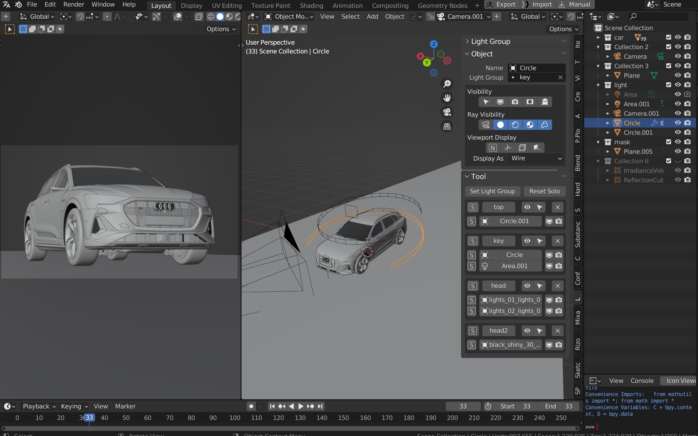

## Lightgroup helper for blender

> help to quickly set up and manage light group, only for blender 3.2 and above

### Features

+ Create
    + set multiple object to one light group(just like creating/moving to collection)
    + solo specific light group (also with reset solo)
    + solo light object in light group
+ Manage
    + easy rename/delete/select light group
    + visibility options for context object
+ Compsite
    + one click create combine passess node group for render layer node(right click menu) 

